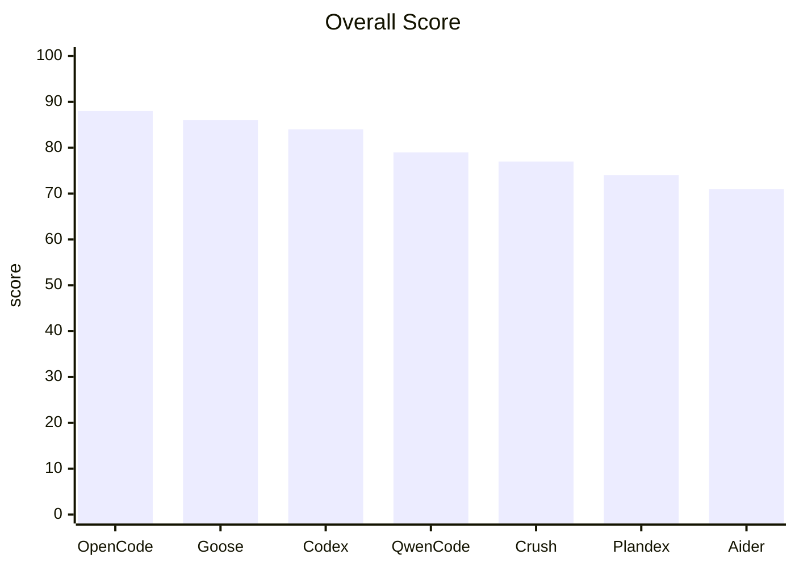

# Comparative Study of CLI Coding Agents with Swappable APIs

## Executive Summary

As of 2026-04-29, after surveying publicly distributed, CLI-accessible general-purpose coding agents for which it is verifiable from primary sources that the model can be swapped at the API level, the top-ranked product by overall capability is OpenCode, followed by Goose and Codex CLI. OpenCode offers the best balance of multi-provider support, MCP, plugins, skills, automatic compaction, web search/web fetch, and session management — and it can also incorporate existing subscriptions like ChatGPT Plus/Pro and GitHub Copilot. Goose, consistent with its vendor background, has a mature MCP/extension system, session persistence, and a skills marketplace, making it appealing for users who want to compose workflows. Codex CLI benefits from OpenAI's commercial ecosystem and a growing plugin/skills/marketplace, though its custom provider and local-model story still show rough edges.

Conversely, Aider delivers excellent edit quality and model flexibility but scores lower on MCP/plugins/skills/marketplace/native web search. Plandex focuses on long-running plan execution and branching, but its extension ecosystem is thin. Qwen Code has rapidly added multi-provider, MCP, extensions, skills, and web search features, but recent issues point to instability around auth/provider/MCP connections. Crush offers a high-quality TUI (Charmbracelet style) and multi-model support, but its plugin/marketplace/native web capabilities are weaker.

## Scope and Selection Criteria

The population for this study is "CLI-operable developer assistance agents" meeting all of: (1) publicly distributed, (2) installable and usable by general users, and (3) configurable so external LLMs (OpenAI/Anthropic/Gemini/Ollama/OpenRouter/other OpenAI-compatible endpoints) can be substituted via provider definitions. Frameworks, IDE-only extensions, or tools effectively locked to a single vendor/model were excluded.

The seven systems scored are OpenCode, Goose, Codex CLI, Qwen Code, Crush, Plandex, and Aider. OpenCode claims 75+ providers and local model support, with MCP, plugins, skills and websearch documented. Goose documents provider settings, MCP-based extensions, skills, a marketplace and session persistence. Codex CLI — as an official OpenAI offering — shows config.toml and Ollama integration enabling custom/local providers in practice. Qwen Code allows switching providers via settings.json's modelProviders. Crush documents OpenAI/Anthropic-compatible APIs and a wide provider set in its README. Plandex documents built-in and custom OpenAI-compatible providers. Aider connects to many providers via LiteLLM.

Excluded examples include Anthropic's Claude Code and Google's Gemini CLI: Claude Code tends to be used primarily within Claude family routing (not wide external LLM substitution), and Gemini CLI's README still focuses on Gemini as of late March 2026, so neither met the "widely swappable external LLM via API" criterion.

This report covers what was discoverable and verifiable from primary sources as of 2026-04-29; it does not claim exhaustive coverage of every fork or very recent wrapper.

## Evaluation Method

Each feature was scored C/M/S = Completion / Maturity / Stability on a 0–5 scale. Completion measures how fully the feature exists; maturity looks at project age, documentation, releases and maintenance cadence; stability looks at recent release notes, open issues and severity of known bugs. The composite score is a weighted average of feature C/M/S values, normalized to a 100-point-like scale; subscription availability adds bonus points.

This evaluation emphasizes platform-level agent capabilities (MCP, plugin, skills, marketplace, session, auto-compaction, websearch/webfetch). Tools specialized for editing (e.g., Aider) may score lower on this axis despite strong editing capabilities.

## Overall Ranking

| Rank | Tool | Score | Subscription Bonus | Short Take | Official |
|---|---:|---:|---:|---|---|
| 1 | OpenCode  | 88 | +5 | Best-balanced across multi-provider, Plugins, Skills, MCP, auto-compaction, WebSearch | Official |
| 2 | Goose  | 86 | +5 | Strong MCP/Extension/Skills/Marketplace/Session persistence | Official |
| 3 | Codex CLI  | 84 | +5 | Strong commercial ecosystem and plugin/marketplace, custom provider still rough | Official |
| 4 | Qwen Code  | 79 | +4 | Rapidly adding multi-provider and extensions, but younger/stability lags | Official |
| 5 | Crush  | 77 | +5 | Excellent TUI and multi-model support; weaker plugin/marketplace/native web | Official |
| 6 | Plandex  | 74 | +0 | Exceptional for long-running plans and branching but weak extension ecosystem | Official |
| 7 | Aider  | 71 | +3 | Very strong editing-focused toolset but lower on platform extension axes | Official |

## Detailed Notes (Per Tool)

OpenCode: most complete agent platform in this comparison. Provider support 75+, MCP supports local/remote, plugins via npm and local placement, skills standardized by SKILL.md, auto compaction config, native websearch and webfetch, sessions with --continue/--session/--fork, and integration to onboard ChatGPT Plus/Pro and GitHub Copilot subscriptions. Weaknesses: an official marketplace is less mature and some resume/TUI issues are visible in issue tracker.

Goose: design centers MCP and extension directory. Built-in extensions, extension manager, chat recall, todo, summon, top-of-mind, memory; skills marketplace and extension directory match the evaluation axes well. Sessions persist to a shared DB usable across CLI/desktop with resume/fork; auto-compaction triggers at thresholds with configuration. It also documents bridging existing subscriptions from other providers. Drawbacks: some constraints when using external CLI providers and rapid product change due to project youth.

Codex CLI: plugin/skills/marketplace expanded rapidly in 2026. Official integration guidance (config.toml, Ollama profiles) shows high likelihood of custom/local provider usage. Remaining issues relate to provider switching UX, Ollama/LM Studio model endpoints, history visibility after provider switching, and compaction behavior — mature but evolving.

Qwen Code: docs grew quickly; supports modelProviders switching across OpenAI/Anthropic/Gemini/Vertex, MCP, Skills, Extensions, Web Search/Fetch, and checkpointing. Strategic advantage: can integrate existing Gemini/Claude marketplaces. Recent issues include auth 401s and provider/MCP connection instability, so maturity and stability lag the top three.

Crush: polished terminal UX and LSP/MCP/skills/multi-model combination are attractive. README documents OpenAI/Anthropic-compatible APIs and provider flexibility. Built-in `crush-config` skill and local model changes continue to be maintained. Weaknesses: plugin/marketplace and websearch/webfetch are not strongly documented; some UI freeze and summarization errors reported.

Plandex: intentionally focused on long-running plan execution (plans/branches/model packs/role-based models/smart context window management/automatic context loading/sliding context). Excellent for long-running iterative workflows but lacks evidence of plugin/skills/marketplace/native websearch/MCP in primary sources.

Aider: one of the most battle-tested terminal coding assistants (2024–2026). Strong in provider flexibility via LiteLLM, repo map, architect/editor modes, lint/test autopatching, web page fetch via /web, auto chat history summarization and --restore-chat-history. However, MCP/plugins/skills/marketplace/native websearch are not evident; sessions are not named multi-session types. Best for edit-and-git workflows rather than extension platforms.

## Comparison Tables

C/M/S = Completion / Maturity / Stability (0 = absent/unknown, 5 = very strong)

| Tool | MCP | Plugin | Skills | Marketplace | Resume | Sessions |
|---|---|---|---|---|---|---|
| OpenCode | 5/4/4 | 5/4/4 | 5/4/4 | 1/1/3 | 5/4/3 | 5/4/3 |
| Goose | 5/4/4 | 5/4/4 | 5/4/4 | 5/4/4 | 5/4/4 | 5/4/4 |
| Codex CLI | 5/4/4 | 5/4/4 | 5/4/3 | 5/4/3 | 5/4/3 | 5/4/3 |
| Qwen Code | 5/3/3 | 5/3/3 | 5/3/4 | 4/3/3 | 4/3/3 | 2/2/3 |
| Crush | 5/4/3 | 0/0/0 | 4/4/4 | 0/0/0 | 4/4/3 | 4/4/3 |
| Plandex | 0/0/0 | 0/0/0 | 0/0/0 | 0/0/0 | 4/5/4 | 5/5/4 |
| Aider | 0/0/0 | 0/0/0 | 0/0/0 | 0/0/0 | 4/5/4 | 2/4/4 |

| Tool | Auto Compaction | Tools | WebSearch | WebFetch | Read | Edit | Subscription |
|---|---|---|---|---|---|---|---|
| OpenCode | 5/4/4 | 5/4/4 | 5/4/4 | 5/4/4 | 5/4/4 | 5/4/4 | Yes |
| Goose | 5/4/4 | 5/4/4 | 4/4/3 | 4/4/4 | 5/4/4 | 5/4/4 | Yes |
| Codex CLI | 5/4/3 | 5/4/3 | 4/4/3 | 3/3/3 | 5/4/3 | 5/4/3 | Yes |
| Qwen Code | 2/2/3 | 5/3/3 | 5/3/3 | 4/3/3 | 5/3/3 | 5/3/3 | Yes |
| Crush | 4/3/3 | 4/4/3 | 1/1/2 | 0/0/0 | 4/4/4 | 4/4/4 | Yes |
| Plandex | 5/5/4 | 3/4/4 | 0/0/0 | 3/4/4 | 5/5/4 | 4/5/4 | Unknown |
| Aider | 5/5/4 | 4/5/4 | 0/0/0 | 4/5/4 | 5/5/4 | 5/5/4 | Yes |

## Top Three Recommendations

I recommend OpenCode as the overall first choice because it holds strong levels across the 12 axes: MCP, plugin, skills, multi-provider, websearch, webfetch, compaction and sessions — and it can ingest existing subscriptions like ChatGPT Plus/Pro and GitHub Copilot. For teams choosing a single CLI agent today, OpenCode is the most pragmatic and has significant upside.

Goose is the second recommendation but is a first-choice candidate if you prioritize MCP and workflow extensibility. Codex CLI is recommended for existing ChatGPT/Codex users due to commercial ecosystem and rapid growth of plugin/marketplace.

## Sources and Limitations

Primary sources were official docs, sites, GitHub repos, release notes and issue trackers. Main references included each project's docs and repositories; see original files for the detailed list.

Limitations: coverage is not exhaustive; stability scoring is qualitative; some features were marked conservatively if existence was confirmed but operational experience was not deeply tested.

(End of file)
