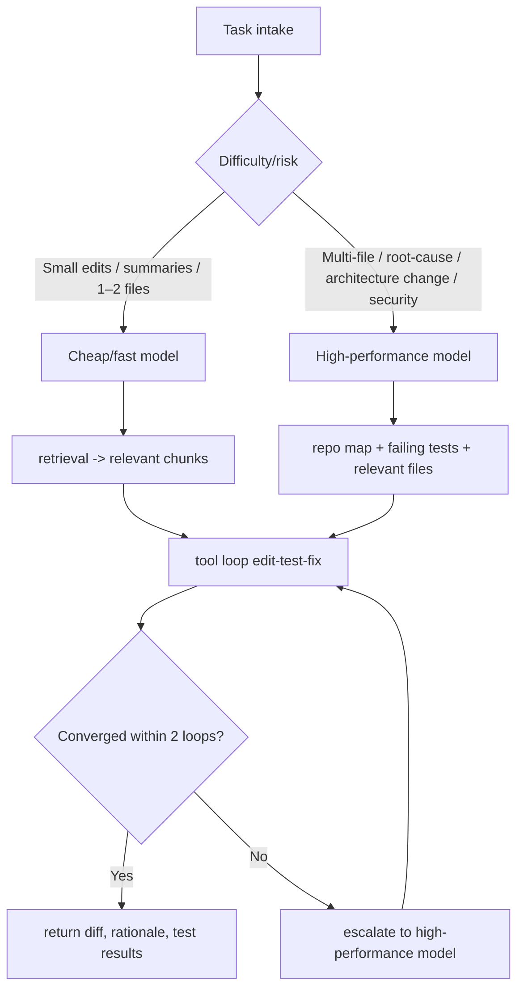

# OpenRouter-Compatible Long-Context Model Selection Report

## Executive Summary

As of 2026-04-28, if your constraints are OpenRouter compatibility, long context, and agentic coding, and you prioritize raw price-performance, the leading choices are DeepSeek V4 Pro and DeepSeek V4 Flash. Both offer ~1M-token context windows and very low per-1M-token prices on OpenRouter; their reported SWE Verified scores are strong. By price/performance alone these two stand out.

For a production default, I recommend a split strategy: use Claude Sonnet 4.6 for difficult tasks and Gemini 3 Flash Preview for easy-to-medium high-volume tasks. Sonnet 4.6 provides 1M context, mature operational guidance, and strong reliability/safety documentation. Gemini 3 Flash Preview offers 1M context, competitive SWE scores, much higher throughput relative to Gemini 2.5 Pro, and lower cost, making it ideal for fast edit–run–fix loops.

If you must run a single model, Gemini 3 Flash Preview is the most practical balance of long context, coding ability, latency and cost. If you need a single-model option biased toward safety for difficult tasks, choose Claude Sonnet 4.6. Note: "latest" family aliases on OpenRouter can change over time — pin date-stamped slugs for reproducible CI.

This report focuses on models listed on OpenRouter and prioritizes primary Japanese-language sources where available (especially for Gemini).

## Evaluation Criteria and Assumptions

The selection weights capabilities toward "solving difficult coding tasks" while accounting for cost and latency. We used these axis weights (percent-like): complex coding performance 30, cost per 1k tokens 20, context length 15, latency 10, reliability 10, safety/guardrails 5, OpenRouter availability 5, model size 5.

Cost estimates assume input:output = 75:25 (agent workflows typically read more than write). Benchmarks are not strict apples-to-apples; vendor bench methodologies and prompts vary, so small numeric differences shouldn't be overinterpreted.

Latency categories (low/medium/high) use public vendor claims where explicit numbers are unavailable. For CI and automation, pin date-stamped slugs rather than family aliases.

## Candidate Model Comparison

| Official Name | Provider | OpenRouter slug | Max Context | Price | Representative Bench / Claims | Latency | Model Size | Known Weaknesses |
|---|---|---|---:|---|---|---|---|---|
| Claude Sonnet 4.6 | Anthropic | anthropic/claude-sonnet-4.6 | 1,000,000 | input $3 / output $15 per 1M | SWE Verified 79.6, Terminal-Bench 59.1 | Medium | undisclosed | Higher unit cost; less suited for very low-cost bulk runs |
| Gemini 3 Flash Preview | Google | google/gemini-3-flash-preview | 1,048,576 | input $0.50 / output $3.00 per 1M | SWE Verified 78; Google claims ~3x throughput vs Gemini 2.5 Pro | Low | undisclosed | Preview status; behavior may change |
| DeepSeek V4 Pro | DeepSeek | deepseek/deepseek-v4-pro | 1,048,576 | input $0.435 / output $0.87 per 1M | SWE Verified 80.6; strong LiveCodeBench | Medium | 1.6T total / 49B active | Newer model; less published safety docs |
| DeepSeek V4 Flash | DeepSeek | deepseek/deepseek-v4-flash | 1,048,576 | input $0.14 / output $0.28 per 1M | SWE Verified 79.0; strong LiveCodeBench | Low | 284B total / 13B active | Less suited for hardest long problems vs Pro |
| GPT-4.1 | OpenAI | openai/gpt-4.1 | 1,047,576 | input $2 / output $8 per 1M | Various benchmarks; mixed coding indicators | Medium–High | undisclosed | Coding metrics lower than top-tier models in this report |
| GPT-4.1 Mini | OpenAI | openai/gpt-4.1-mini | 1,047,576 | input $0.40 / output $1.60 per 1M | Mixed metrics; lower coding robustness | Low | undisclosed | Weaker on hardest bug-fix/multi-file refactor tasks |
| Devstral 2 2512 | Mistral AI | mistralai/devstral-2512 | 262,144 | input $0.40 / output $2.00 per 1M | SWE Verified 72.2; agentic coding focus; open-weight | Medium | 123B dense | Not 1M-class context; generalist gaps vs frontier models |
| Gemini 3.1 Pro Preview | Google | google/gemini-3.1-pro-preview | 1,048,576 | input $2 / output $12 per 1M | Google positions it highly for agentic coding | Medium | undisclosed | Preview; bench parity details limited |

Price-performance favors DeepSeek V4 Pro/Flash. Sonnet 4.6 offers stronger operational maturity and safety documentation. Gemini 3 Flash Preview offers a practical tradeoff of cost, latency and capability.

## Recommended Configurations

Production default (split strategy):

- Hard tasks: anthropic/claude-sonnet-4.6
- Easy–medium bulk tasks: google/gemini-3-flash-preview

Rationale: Hard tasks benefit from Sonnet's strong demonstrated ability and documentation; routine quick iterations benefit from Gemini Flash's throughput and lower cost.

Cost-priority alternative:

- Hard tasks: deepseek/deepseek-v4-pro
- Easy tasks: deepseek/deepseek-v4-flash

This configuration is the lowest-cost option with good reported coding figures but has comparatively thinner safety/operational documentation and therefore requires caution for sensitive/regulated workloads.

Single-model fallback: Gemini 3 Flash Preview as the best single-model balance. Claude Sonnet 4.6 if you need to bias toward robustness for hard tasks.

## Agentic Coding Operation Guidance

Prompting: include persistence, tool-calling, and planning in system prompts. Anthropic recommends XML-like structuring (<instructions>, <context>, <files>, <tests>, <constraints>). For long inputs, place long documents earlier and concise questions later. For GPT-4.1, duplicate critical instructions at both the start and end.

Long-context chunking: avoid sending full repo every time. Build a working set with repo map, dependencies, failing tests, relevant files, and pass that as the active context. Treat large context windows as a resource to be used judiciously, not unlimited memory.

Retrieval and embeddings: use RAG/vector stores for stable knowledge (repo/docs). OpenAI Retrieval and Google Gemini File Search are suitable for indexing and retrieving relevant chunks.

Memory management: split memory into working memory, compressed summaries, and persistent vector memory. Compress conversation with compaction and move long-lived artifacts to vector stores.

Temperature/decode heuristics: use temperature 0–0.2 for patch generation and test-fix loops; 0.3–0.5 for idea generation. Prefer prompt clarity and tool contracts to sampling adjustments.

Cost controls: use OpenRouter routing options (price/latency/throughput sorting) and provider fallbacks. Use caching, vendor prompt caching and OpenRouter response caching to reduce cost and latency.

CI tips: pin date-stamped slugs rather than latest family aliases for reproducible results.

## Cost Estimates

Monthly estimate assumptions: small=100k, medium=1M, large=10M tokens/month; input:output = 75:25; avg request 2,000 tokens. This excludes RAG storage, external search, code execution, vector DB, or managed-agent time.

Per-model rough monthly cost table and blended strategies were computed; DeepSeek V4 Flash is extremely low-cost per token, making low-cost splits compelling. The split Sonnet 4.6 + Gemini 3 Flash yields a balanced blended cost while preserving quality for hard tasks.

## Conclusion

Production default: Claude Sonnet 4.6 (hard) + Gemini 3 Flash Preview (easy) split.
Absolute cost priority: DeepSeek V4 Pro + DeepSeek V4 Flash.
Single-model pragmatic default: Gemini 3 Flash Preview.

Operational recommendation: use cheap model as default router and escalate to hard model for failed tool loops, multiple-file edits, unresolved tests, infra/security changes, or heavy input contexts. Pin slugs in CI and use latest aliases interactively.

(End of file)
