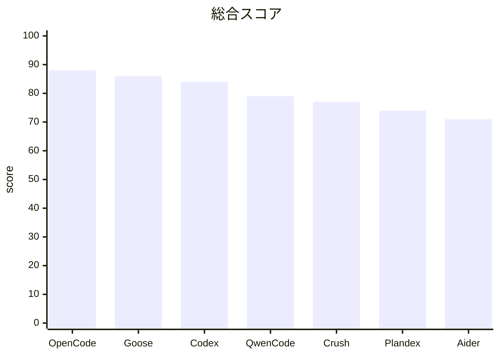

# API差し替え可能なCLI Coding Agentの比較研究

## エグゼクティブサマリ

2026年4月29日時点で、公開配布され、CLIで利用でき、かつ**APIレベルでモデル差し替えが一次情報で確認できた**一般向け Coding Agent を洗い出して比較すると、総合力の首位は **OpenCode**、次点が **Goose**、三位が **Codex CLI** でした。OpenCode は「多プロバイダ」「MCP」「プラグイン」「Skills」「自動コンパクション」「WebSearch/WebFetch」「セッション管理」のバランスが最も良く、しかも ChatGPT Plus/Pro や GitHub Copilot のような既存サブスクリプションの取り込みまでできる点が強いです。Goose は entity["company","Block","fintech company"] 製らしく、MCP/拡張機構/セッション永続化/Skills marketplace の完成度が高く、ワークフロー自体を組み立てたい人に向きます。Codex CLI は entity["company","OpenAI","ai company"] の公式/商用エコシステムと、プラグイン・Skills・Marketplace の伸びが大きな強みですが、カスタム provider・ローカルモデルまわりはまだ粗さが残ります。

逆に、**Aider** は編集品質とモデル自由度は非常に高い一方で、今回の評価軸である MCP / plugin / skills / marketplace / native web search が弱く、**Plandex** は長時間プラン実行・ブランチ・コンテキスト管理が強い反面、拡張エコシステムが薄いため総合では伸びませんでした。**Qwen Code** は多プロバイダ・MCP・Extensions・Skills・WebSearch を短期間で揃えた急成長株ですが、最近の issue には auth / provider / MCP connection の荒れが見え、安定度は上位3つに一歩譲ります。**Crush** は Charmbracelet の TUI 品質とマルチモデル対応が魅力ですが、plugin / marketplace / native web 系は弱めです。

## 調査対象と選定基準

今回の母集団は、**「CLI で操作可能な開発支援エージェント」**のうち、次の条件をすべて満たすものに限定しました。第一に、公開配布されていること。第二に、一般ユーザーがインストールして使えること。第三に、**OpenAI / Anthropic / Gemini / Ollama / OpenRouter / 独自 OpenAI 互換 endpoint などを設定や provider 定義で差し替えられること**です。研究用フレームワーク、IDE 専用拡張、または単一ベンダー/単一モデルに実質固定されているものは除外しました。

この基準で**採点対象**にしたのは、**OpenCode / Goose / Codex CLI / Qwen Code / Crush / Plandex / Aider**の7本です。OpenCode は 75+ provider と local model を掲げ、MCP・plugins・skills・websearch を明示しています。Goose は provider 設定、MCP ベース extensions、skills、marketplace、session persistence を明文化しています。Codex CLI は OpenAI 公式ながら、`config.toml` と Ollama integration で custom provider / local provider の実運用が確認できます。Qwen Code は `settings.json` の `modelProviders` で OpenAI / Anthropic / Gemini / Vertex を切り替えられます。Crush は OpenAI / Anthropic 互換 API と幅広い provider を README で案内しています。Plandex は built-in provider 群と custom OpenAI-compatible provider を公式 docs でサポートしています。Aider は LiteLLM ベースで多数の provider を接続できます。

**除外した代表例**は、entity["company","Anthropic","ai company"] の Claude Code と entity["company","Google","tech company"] の Gemini CLI です。Claude Code は MCP は非常に強いものの、一次情報では Claude family を Bedrock / Vertex / proxy 経由で切り替える形が中心で、今回の「外部 LLM を広く API で差し替え可能」という基準には達しませんでした。Gemini CLI は extension と MCP は強い一方、公式 README が Gemini 専用であり、OpenAI-compatible/ollama 対応は 2026年3月末時点でも要望段階でした。

なお、**「ネット上に存在するすべて」**を文字通り厳密に保証することは不可能です。そこで本レポートでは、**2026年4月29日時点で公に発見可能で、一次情報で主要機能を検証できた、一般向けCLI Coding Agent**を対象にしています。派生 fork やごく新しい wrapper まで完全網羅はしていません。たとえば LLxprt Code のような有望候補は確認できましたが、今回要求された12機能を同じ精度で点数化するだけの一次情報がまだ薄く、主ランキングからは外しました。

## 評価方法

各機能について **C/M/S = 完成度 / 成熟度 / 安定度** を 0〜5 で採点しました。  
完成度は「その機能がどこまで製品として揃っているか」、成熟度は「開発年齢・公式ドキュメント整備・release 運用・継続更新」、安定度は「最近の release note、open issues、既知バグの重さ」から判断しています。総合点は**各機能の C/M/S を重み付き平均し、最後にサブスクリプション利用可なら加点**した 100 点満点相当の丸め値です。

今回の評価軸では、単に「コード編集がうまい」だけでは上位になりません。**MCP / plugin / skills / marketplace / session / auto-compaction / websearch / webfetch** のような“エージェント基盤”を広く持っている製品ほど有利です。そのため、Aider のような編集特化型は質実剛健でも順位が下がり、Goose や OpenCode のような“拡張可能な実行基盤”が上がる構図になりました。

## 総合ランキング

| 順位 | ツール | 総合点 | サブスク加点 | 一言評価 | 公式 |
|---|---:|---:|---:|---|---|
| 1 | OpenCode  | 88 | +5 | 多プロバイダ・Plugins・Skills・MCP・自動コンパクション・WebSearch が最も均衡 | 公式  |
| 2 | Goose  | 86 | +5 | MCP/Extension/Skills/Marketplace/Session 永続化が非常に強い | 公式  |
| 3 | Codex CLI  | 84 | +5 | 商用エコシステムと plugin/marketplace が強いが custom provider はまだ粗い | 公式  |
| 4 | Qwen Code  | 79 | +4 | 多プロバイダと拡張性は高いが、安定度は上位勢より若い | 公式  |
| 5 | Crush  | 77 | +5 | TUI とマルチモデルは良いが plugin/marketplace/native web が弱い | 公式  |
| 6 | Plandex  | 74 | +0 | 長時間プラン・分岐・コンテキスト制御は優秀だが拡張生態系が薄い | 公式  |
| 7 | Aider  | 71 | +3 | 編集特化では依然強いが、今回の基盤機能軸では不利 | 公式  |

## 各ツール個別評価

**OpenCode** は、今回の比較で最も“エージェント基盤として完成している”製品でした。provider は 75+、MCP は local/remote 両対応、plugins は npm とローカル配置の両方、skills は `SKILL.md` で標準化、自動 compaction は `auto/prune/reserved` まで持ち、`websearch` と `webfetch` を両方ネイティブで備えます。さらに sessions は `/sessions` と `--continue` / `--session` / `--fork` まであり、ChatGPT Plus/Pro や entity["company","GitHub","developer platform"] Copilot の既存サブスクを取り込めるのが大きいです。弱点は、Goose や Codex ほど明確な“公式 marketplace”がまだ育っていないことと、issue トラッカー上では resume 周辺や TUI の不具合が相応に見えることです。

**Goose** は、MCP と extension directory を中核に据えた設計が非常に明快です。built-in extensions、Extension Manager、Chat Recall、Todo、Summon、Top of Mind、Memory まで用意され、skills marketplace と extension directory の存在が今回の評価軸に非常に合っています。session は CLI/desktop 共通 DB に保存され、`goose session -r` で resume、fork も可能で、auto-compaction は 80% 到達時自動発火と threshold 設定まであります。加えて、Claude Code / Cursor Agent / Gemini CLI の既存サブスクリプションを Goose の CLI providers として取り込める点が、実運用でかなり強いです。欠点は、CLI providers 経由だと Goose 自身の extension ecosystem が使えない制約があることと、若いプロジェクトなので release の勢いのぶん変化も速いことです。

**Codex CLI** は、plugin / skills / marketplace が 2026 年に入って急速に厚くなったのが印象的です。OpenAI の help と release notes では、CLI が read / modify / run code を担う軽量 coding agent と位置づけられ、release 0.121.0 では marketplace add、plugin marketplace、MCP/plugin support 拡張、resume/history 周辺の修正が明記されています。さらに、entity["company","Ollama","local llm tooling"] 公式 integration は `--oss` や `config.toml` の profile を案内しており、local provider / custom provider の利用自体は高い確度で確認できます。一方で、custom provider の model switcher、Ollama/LM Studio の `/model`、provider 切り替え後の history visibility、compact task などは issue が残っており、成熟は高いが安定はまだ“発展中”です。サブスク利用面では ChatGPT Plus/Pro/Business/Enterprise/Edu に含まれる点が大きいです。

**Qwen Code** は、公式 docs の増え方が非常に速く、`modelProviders` による OpenAI / Anthropic / Gemini / Vertex 切替、`/model` 切替、MCP、Skills、Extensions、Web Search、Web Fetch、checkpointing、read/edit tool のドキュメントが揃っています。Marketplace を自前で閉じるのではなく、Gemini CLI gallery と Claude Code marketplace の両方を取り込めるのは戦略的に強いです。ただし、recent issues には auth 401、OpenAI-compatible provider 表示不具合、MCP connection limit、provider まわりの rough edge がまだ多く、成熟度・安定度は OpenCode / Goose / Codex より一段下に置くのが妥当でした。なお Qwen OAuth の無料枠は 2026-04-15 で終了し、readme は API key or Coding Plan への移行を案内しています。

**Crush** は、Charmbracelet らしい洗練された terminal UX と、LSP / MCP / agent skills / multi-model の組み合わせが魅力です。README では OpenAI- / Anthropic-compatible API、provider 自由度、session-based context、LSP、MCP、Agent Skills を明示しており、release note からは built-in `crush-config` skill や local model 修正が継続していることも読み取れます。加えて、Synthetic や Kimi など subscription-based usage を明記している点は加点対象です。ただし plugin と marketplace は弱く、websearch / webfetch も一次情報では強く確認できませんでした。最近の issues には UI freeze や summarization/overloaded error なども見えるため、上位3本に比べると安定度は一段落ちます。

**Plandex** は、他ツールが拡張エコシステムへ寄るのに対し、**長時間の計画実行**そのものに振り切った設計です。plans / branches / model packs / role-based models / smart context window management / automatic context loading / sliding context まで持っており、長い修正を branch しながら回す用途では今でも非常に強いです。一方で、plugin / skills / marketplace / native websearch / MCP の一次情報は確認できず、今回の“現代的 agent platform”の評価軸では不利でした。言い換えると、Plandex は「拡張可能な万能エージェント」ではなく「長距離走向けの計画実行システム」です。

**Aider** は、2024〜2026 にかけてもっとも実績のある terminal coding assistant のひとつで、LiteLLM 経由の provider 自由度、repo map、architect/editor mode、lint/test 自動修正、`/web` による web page fetch、auto chat history summarization、`--restore-chat-history` による復帰など、**コード編集の実戦力**は依然として高いです。ただし、MCP / plugin / skills / marketplace / native websearch は見当たらず、セッション管理も named multi-session 系ではありません。そのため、「diff 編集と git 連携で最短距離を進みたい」人には今も有力ですが、今回の比較軸では総合順位は下がります。

## 比較表

C/M/S = **完成度 / 成熟度 / 安定度**。  
0 は未確認または実質非搭載、5 は現時点で非常に強いことを示します。

| ツール | MCP | Plugin | Skills | Marketplace | Resume | Sessions |
|---|---|---|---|---|---|---|
| OpenCode | 5/4/4 | 5/4/4 | 5/4/4 | 1/1/3 | 5/4/3 | 5/4/3 |
| Goose | 5/4/4 | 5/4/4 | 5/4/4 | 5/4/4 | 5/4/4 | 5/4/4 |
| Codex CLI | 5/4/4 | 5/4/3 | 5/4/3 | 5/4/3 | 5/4/3 | 5/4/3 |
| Qwen Code | 5/3/3 | 5/3/3 | 5/3/4 | 4/3/3 | 4/3/3 | 2/2/3 |
| Crush | 5/4/3 | 0/0/0 | 4/4/4 | 0/0/0 | 4/4/3 | 4/4/3 |
| Plandex | 0/0/0 | 0/0/0 | 0/0/0 | 0/0/0 | 4/5/4 | 5/5/4 |
| Aider | 0/0/0 | 0/0/0 | 0/0/0 | 0/0/0 | 4/5/4 | 2/4/4 |

| ツール | Auto Compaction | Tools | WebSearch | WebFetch | Read | Edit | サブスク可否 |
|---|---|---|---|---|---|---|---|
| OpenCode | 5/4/4 | 5/4/4 | 5/4/4 | 5/4/4 | 5/4/4 | 5/4/4 | あり |
| Goose | 5/4/4 | 5/4/4 | 4/4/3 | 4/4/4 | 5/4/4 | 5/4/4 | あり |
| Codex CLI | 5/4/3 | 5/4/3 | 4/4/3 | 3/3/3 | 5/4/3 | 5/4/3 | あり |
| Qwen Code | 2/2/3 | 5/3/3 | 5/3/3 | 4/3/3 | 5/3/3 | 5/3/3 | あり |
| Crush | 4/3/3 | 4/4/3 | 1/1/2 | 0/0/0 | 4/4/4 | 4/4/4 | あり |
| Plandex | 5/5/4 | 3/4/4 | 0/0/0 | 3/4/4 | 5/5/4 | 4/5/4 | 未確認 |
| Aider | 5/5/4 | 4/5/4 | 0/0/0 | 4/5/4 | 5/5/4 | 5/5/4 | あり |

## 推奨トップ三

**OpenCode** を総合一位に推します。理由は、今回の12軸のうち、MCP / plugin / skills / multi-provider / websearch / webfetch / compaction / sessions を**全部それなり以上ではなく、ほぼ全部強い**水準で持っているからです。しかも ChatGPT Plus/Pro と GitHub Copilot の既存契約まで持ち込めるため、コスト面でも現実的です。チームで “主力 CLI agent を一つ選ぶ” なら、現時点では最も無難で、かつ伸びしろも大きい選択です。

**Goose** は二位ですが、**MCP とワークフロー拡張性を最重視するなら一位候補**です。extension directory、skills marketplace、session persistence、auto-compaction、CLI provider bridge まで揃っており、「Coding Agent を IDE 代替ではなく、自分用の automation platform にしたい」人に最も向いています。単体の coding benchmark より、組織の道具箱としての完成度を買う製品です。

**Codex CLI** は三位ですが、**ChatGPT/Codex の既存利用者**には最もおすすめしやすい一本です。plugin / skills / marketplace の伸びが著しく、CLI・IDE・cloud agent・desktop をまたいだ体験がつながっているのは大きいです。custom provider / local model 周辺の rough edge はまだありますが、商用バックアップ・プラットフォーム横断・サブスク同梱まで含めると、“今すぐ仕事に入れる” という意味では非常に強いです。

## 参考URL一覧と調査限界

主要ソースは、各製品の**公式 docs / 公式サイト / 公式 GitHub repo / release notes / issue tracker**です。主に参照した一次情報は以下です。  
Aider docs と GitHub history / issues。  
Goose docs、extension directory、skills marketplace、CLI providers、session/context docs。  
OpenCode docs と公式サイト。  
Crush README、releases、issues。  
Plandex docs。  
Qwen Code docs、repo、release / issues。  
Codex の OpenAI Help / product pages / repo releases / Ollama integration。

限界もあります。第一に、派生 fork や非常に新しい wrapper は網羅しきれていません。第二に、**stability は issue 数だけでなく issue の重さと release の修正速度で見ていますが、これはどうしても定性的**です。第三に、各 feature の一部は “存在は確認できるが実運用体験までは深掘りしきれていない” ものがあり、その場合は保守的に点を下げています。とくに LLxprt Code のような新興候補は、今回の 12 軸すべてを同精度で採点できるだけの一次情報が揃わず、主ランキングから外しました。