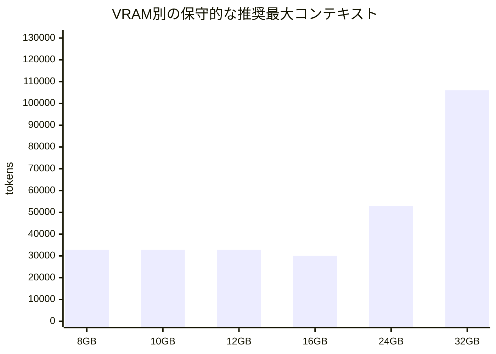

# Hugging Faceで入手できるGGUF前提のエージェンティックコーディング向けLLM調査

## エグゼクティブサマリ

2026年4月時点で、**32GB以下のローカルGPUを前提にしたGGUF運用**で、最も実戦的な本命は **Devstral-Small-2507**、**Qwen3-Coder-30B-A3B-Instruct**、**Qwen2.5-Coder-14B/7B** です。特に Devstral は「agentic coding」を明示的に狙った設計で、SWE-bench Verified 53.6 を公式に掲げ、24B級としては最も高信頼です。

**最高性能の“最新系”**としては Qwen3-Coder-Next 系が非常に強力ですが、公式GGUFの **Q4_K_M だけで 48.4GB** あるため、今回の 32GB 上限では実用対象から外れます。代わりに、**Qwen3-Coder-30B-A3B-Instruct-GGUF** は Q4_K_M 19.2GB で入手でき、**長い文脈と高いツール利用性**を両立しやすい、現実的な最新候補です。

**32GB未満での“密度あたりの安定感”**では、Qwen2.5-Coder 系が依然として強いです。特に 32B は、コード生成・修復・多言語コードで公式ベンチが強く、GGUFも公式配布があります。ただし **公式GGUFは実質 32k 文脈前提**で、128k を取りたければ GGUF ではなく非GGUF系を見た方がよい、という制約があります。

**16GB以下**になると、現実解は **Qwen2.5-Coder-14B** と **Qwen2.5-Coder-7B** です。長文優先なら **DeepSeek-Coder-V2-Lite** が有力ですが、これは MLA 系アーキテクチャのため、他モデルと同じ単純な KV キャッシュ計算で比較しにくく、ランタイム差も大きい点に注意が必要です。

## 選定方針と結論

本レポートでは、entity["company","Mistral AI","French AI company"]、entity["company","Alibaba Cloud","cloud provider"]系の Qwen、entity["company","DeepSeek","AI lab"] の**公式モデルカード**、および entity["organization","llama.cpp","ggml project"]、entity["organization","vLLM","LLM inference engine"]、entity["company","LM Studio","local AI software company"] の公式ドキュメントを優先し、そこにコミュニティの GGUF 配布リポジトリを重ねて評価しました。エージェンティックコーディングという用途上、単なる HumanEval よりも、**SWE-bench、Aider/コード修復、長文・ツール利用**に直結する記述を強く評価しています。

結論を一言でまとめると、**品質最優先で 24–32GB を使えるなら Devstral-Small-2507 を軸にするのが最も堅い**です。SWE-bench Verified 53.6 を公式に示し、OpenHands 系のエージェント運用にそのまま乗せやすく、Apache 2.0 で扱いやすいからです。対して、**長いコンテキストと最新のエージェント適性をより重視するなら Qwen3-Coder-30B-A3B-Instruct-GGUF** が面白く、**32GBなら 100k 超級、24GBでも 30k 超級**を狙えます。

また、**SWE-bench の数字だけを最上位にしたい**なら DeepSWE-Preview が有力です。公式カードでは **SWE-bench Verified 59.0（hybrid Best@16）/ 42.1（pass@1）** を掲げており、OpenHands や R2E-Gym に近いワークフローで非常に強いです。ただし、今回確認できた GGUF はコミュニティ配布が中心で、**40k 文脈・Qwen3-32Bベース・量子化品質差**を踏まえると、汎用の第一候補というよりは「SWE-bench 志向の専門枠」と見るのが安全です。

一方で、**Qwen3-Coder-Next** は家の単GPUローカル運用という条件では今回は外します。理由は単純で、**公式GGUFの最小実用量子化 Q4_K_M が 48.4GB** だからです。性能は非常に魅力的ですが、今回の VRAM 帯では現実的ではありません。

## 比較表

表中の **速度目安** は、公式の横並び tok/s ベンチが不足しているため、**総/アクティブパラメータ、層数、KV キャッシュ効率、公式の“latency optimized”記述**を踏まえた**相対評価**です。`◎` が速い、`○` が中間、`△` が重いです。

| モデル名 | HF GGUF repo | ベースアーキテクチャ | パラメータ推定 | GGUFビルド / 推奨量子化 | ライセンス | 推論フレームワーク互換性 | 速度目安 | 推定VRAM要件と最大コンテキスト長 | 備考 / 根拠 |
|---|---|---|---:|---|---|---|---|---|---|
| **Devstral-Small-2507** | `mistralai/Devstral-Small-2507_gguf` | Mistral Small 3.1 派生 | 24B | 公式: Q4_K_M / Q5_K_M / Q8_0。**推奨: Q5_K_M（24–32GB）, Q4_K_M（24GB境界）** | Apache 2.0 | 非GGUFは `transformers`/vLLM、GGUFは llama.cpp / LM Studio 系が本命 | ○〜◎ | **32GB:** Q4≈106k, Q5≈90k / **24GB:** Q4≈54k, Q5≈38k / **16GB以下:** 公式量子化では厳しい | agentic coding 特化。SWE-bench Verified **53.6**。128k 文脈。単一 RTX 4090 / 32GB Mac 級を公式想定。 |
| **DeepSWE-Preview** | `bartowski/agentica-org_DeepSWE-Preview-GGUF` など | Qwen3-32B ベース | 33B級 | コミュニティ GGUF。**推奨: Q4_K_M（32GB）, Q3_K_M（24GB）** | MIT | GGUFは llama.cpp / LM Studio 系、元モデルは OpenAI互換APIやOpenHands系で使われる | △ | **32GB:** Q4≈40k上限, Q3≈40k上限 / **24GB:** Q3≈27k, Q4≈11k / **16GB以下:** 実用は厳しい | SWE-bench Verified **59.0**（hybrid Best@16）、pass@1 **42.1**。ただしその数値は test-time scaling 前提で、GGUF はコミュニティ量子化。LM Studio系カードでは 40k 文脈。 |
| **Qwen3-Coder-30B-A3B-Instruct** | `unsloth/Qwen3-Coder-30B-A3B-Instruct-GGUF` | Qwen3 MoE | 30.5B total / 3.3B active | 多数の量子化あり。**推奨: Q4_K_M（24–32GB）, Q5_K_M（32GB質重視）, Q2_K（16GB妥協）** | Apache 2.0 | 非GGUFは `transformers`、ローカルは Ollama / LM Studio / llama.cpp / KTransformers を公式カードが言及 | ◎ | **32GB:** Q4≈123k, Q5≈96k / **24GB:** Q4≈36k / **16GB:** Q2≈35k, Q3≈13k / **12GB:** IQ1/QTQ1系で≈27k前後も品質低下大 | 262k ネイティブ、ツール利用に強いと公式記述。ローカル用としては最も“最新らしい”候補。公開定量ベンチは旗艦より少ないが、長文・tool-calling の実用性が高い。 |
| **Qwen2.5-Coder-32B-Instruct** | `Qwen/Qwen2.5-Coder-32B-Instruct-GGUF` | Qwen2.5 Coder | 32.5B | 公式: q2_K〜q8_0。**推奨: Q4_K_M（32GB）, Q3_K_M（24GB）, Q2_K（16GBの非常用）** | Apache 2.0 | GGUFは llama.cpp 主体。`transformers` はGGUFを読めるが **FP32へ展開**するため低VRAM用途には不向き | △ | **32GB:** Q4=32k上限, Q5≈29k / **24GB:** Q2=32k上限, Q3≈27k, Q4≈11k / **16GB:** Q2≈9k / **12GB以下:** × | 公式ベンチが非常に強い。Aider **73.7**、McEval **65.9**、MdEval **75.2**。ただし**公式GGUFは実質 32,768 token 前提**で、128k を使いたいなら非GGUFを勧める記述。 |
| **DeepSeek-Coder-V2-Lite-Instruct** | コミュニティ GGUF多数（例: `bartowski/deepseek-ai_DeepSeek-Coder-V2-Lite-Instruct-GGUF` 系） | DeepSeek-V2 MoE / MLA | 16B total / 2.4B active | コミュニティ GGUFに Q4_K_M 10.4GB、Q3_K_M 8.13GB 級あり。**推奨: Q4_K_M（12–16GB）** | DeepSeek License（商用可だが独自） | 公式は `transformers` と vLLM を案内。GGUFは llama.cpp 系の実装差が出やすい | ◎（効率特化） | **MLAのため単純KV式の比較対象外。** 実測では **16GB級で長文志向の有力候補**、12GBでも候補になりやすい | 128k 文脈、338 言語対応、GPT‑4‑Turbo 級に迫ると公式記述。GGUFでは MLA 実装差があるため、他モデルほど厳密な一律見積りがしづらい。 |
| **Codestral-22B-v0.1** | `second-state/Codestral-22B-v0.1-GGUF` など | Mistral | 22B | コミュニティ GGUF。**推奨: Q5_K_M（24GB）, Q4_K_M（16–24GB）** | **MNPL-0.1** | 元モデルは vLLM / mistral-inference 記載、GGUFは llama.cpp / LlamaEdge 系 | ○ | **32GB:** Q8≈32k上限 / **24GB:** Q5≈32k, Q4=32k / **16GB:** Q3≈17k, Q2≈29k / **12GB:** Q2≈10k / **10GB以下:** 厳しい | 80+言語、FIM 向き。**ただしライセンスが非本番寄り**で、エージェント本番用途の第一候補にはしにくい。32k 文脈。citeturn33search0turn33search5turn33search8turn41search0turn41search1turn33search12 |
| **Qwen2.5-Coder-14B-Instruct** | `Qwen/Qwen2.5-Coder-14B-Instruct-GGUF` | Qwen2.5 Coder | 14.7B | 公式: q2_K〜q8_0。**推奨: Q4_K_M（16GB）, Q5_K_M（24GB）, Q8_0（24–32GB）** | Apache 2.0 | GGUFは llama.cpp / LM Studio 本命。非GGUFは `transformers` / vLLM | ○ | **32GB:** Q8=32k上限 / **24GB:** Q8=32k上限 / **16GB:** Q4≈30k, Q5≈22k / **12GB:** Q3≈17k, Q2≈26k / **10GB:** Q2≈15k / **8GB:** Q2≈4k | 16GB帯の最重要候補。Qwen2.5-Coder 系はサイズ増加で一貫して性能向上と公式記述。GGUFは 32k 上限。 |
| **Qwen2.5-Coder-7B-Instruct** | `Qwen/Qwen2.5-Coder-7B-Instruct-GGUF` | Qwen2.5 Coder | 7.61B | 公式: q2_K〜q8_0。**推奨: Q4_K_M（8GB）, Q6_K（10GB）, Q8_0（12GB以上）** | Apache 2.0 | GGUFは llama.cpp / LM Studio、本番的な軽量ローカル候補 | ◎ | **32/24/16/12GB:** Q8=32k上限 / **10GB:** Q6=32k上限 / **8GB:** Q4=32k上限 | 8–10GB帯の最有力。Qwen 公式は 7B の code reasoning の強さも強調。小ささに対してかなりまとまりが良い。 |

**除外したが要注目**なのは **Qwen3-Coder-Next-GGUF** です。agentic coding の方向性は最先端ですが、公式 GGUF は **Q4_K_M 48.4GB / Q5_K_M 56.7GB / 256k native** なので、今回の 32GB 上限では実用外です。

## VRAM別推奨モデルと設定

以下は、**「品質を落としすぎない」「実際にエージェント運用しやすい」**ことを優先した、私の推奨プリセットです。`eval_batch_size` は大きいほど速くなりやすい一方でメモリを使い、Flash Attention と KV cache quantization は長文運用時に効きます。これは entity["company","LM Studio","local AI software company"] の load config ドキュメントでも明示されています。

| VRAM | 第一推奨 | 第二推奨 | 推奨量子化 | 推奨コンテキスト | 推奨設定の目安 |
|---|---|---|---|---|---|
| **32GB** | **Devstral-Small-2507** | **Qwen3-Coder-30B-A3B-Instruct** | Devstral: `Q5_K_M` / Qwen3-Coder: `Q5_K_M` か `Q4_K_M` | Devstral: 64k–96k、Qwen3-Coder: 64k–96k | `flash-attn ON`、`eval_batch_size 256–512`、GPU full offload、KV cacheはまず FP16、96k以上を狙うなら `q8_0` KV か `q4_0` KV を検討。 |
| **24GB** | **Devstral-Small-2507** | **Qwen3-Coder-30B-A3B-Instruct** | Devstral: `Q4_K_M` / Qwen3-Coder: `Q4_K_M` | Devstral: 32k–53k、Qwen3-Coder: 32k–36k | `eval_batch_size 256`、Flash Attention必須。エージェントの1ターンが長いなら Devstral、複数ツール呼び出しと長文設計なら Qwen3-Coder。 |
| **16GB** | **Qwen2.5-Coder-14B-Instruct** | **DeepSeek-Coder-V2-Lite-Instruct** | Qwen2.5-14B: `Q4_K_M` / DeepSeek Lite: `Q4_K_M` | Qwen: 24k–30k、DeepSeek Lite: 長文志向だが実装差あり | まずは Qwen 14B を堅く使う。長文を本気で取りたいなら DeepSeek Lite を検証する価値があるが、GGUF/MLA 実装差の検証が必要。 |
| **12GB** | **Qwen2.5-Coder-7B-Instruct** | **DeepSeek-Coder-V2-Lite-Instruct** | Qwen: `Q8_0` か `Q6_K` / DeepSeek Lite: `Q4_K_M` | Qwen: 32k、DeepSeek Lite: 64k以上も理論上狙えるが要実測 | 安定性は Qwen 7B、長文効率は DeepSeek Lite。まず Qwen 7B でエージェントの scaffold を固め、必要なら DeepSeek Lite に差し替えるのが安全。 |
| **10GB** | **Qwen2.5-Coder-7B-Instruct** | — | `Q6_K` か `Q5_K_M` | 16k–32k | `eval_batch_size 128`、Flash Attention ON。8k〜16k の作業なら `Q8_0` も候補だが余裕は薄い。 |
| **8GB** | **Qwen2.5-Coder-7B-Instruct** | — | `Q4_K_M` | 16k–32k | もっとも無難な帯。エージェントは「小さな編集単位」「短い diff」「短めの repo context」に寄せるのがコツ。 |

**実務上のおすすめ順**は、  
**32/24GB: Devstral → Qwen3-Coder-30B → DeepSWE**、  
**16/12GB: Qwen2.5-14B → DeepSeek Lite → Qwen2.5-7B**、  
**10/8GB: Qwen2.5-7B 一択に近い**、です。理由は、SWE-bench の強さだけでなく、**量子化後の安定性・ライセンス・ツール接続のしやすさ・文脈長の現実性**まで含めると、この順がもっとも“事故が少ない”からです。



上のチャートは、**そのVRAM帯で私が第一推奨とした構成**を保守的に置いたものです。8–12GB は Qwen2.5-Coder-7B、16GB は Qwen2.5-Coder-14B Q4_K_M、24–32GB は Devstral Q4_K_M を基準にしています。Qwen3-Coder-30B-A3B は 32GB で 100k 超も狙えますが、現時点では Devstral の方が agentic coding 用途の信頼性が高いので、図では Devstral を採っています。

## メモリ計算根拠

今回の VRAM 見積りは、**「単一GPU・フルオフロード・Flash Attention 有効・KV cache は FP16・ランタイム予約 1.5GB」**を基準にした近似です。GGUF の読み込み先としては、現時点で依然 **llama.cpp 系が主流**で、`transformers` の GGUF ロードは**最終的にFP32へ展開して学習・変換に使う向きが強い**ため、低VRAMサービング経路としては見ていません。vLLM の GGUF load は**experimental**です。

近似式は次です。  
**最大コンテキスト ≒ floor((VRAM - 予約領域 - GGUF重みサイズ) / 1token当たりKVキャッシュ量)**。  
標準的な GQA/注意モデルでは、  
**KV/token ≒ layers × kv_heads × head_dim × 2(K,V) × 2bytes(FP16)**  
で置けます。たとえば Devstral/Mistral Small 3.1 系は 40 層・8 KV heads・head_dim 128 なので **160KiB/token**、Qwen2.5-Coder-32B と Qwen3-32B ベースは 64 層・8 KV heads・head_dim 128 で **256KiB/token**、Qwen2.5-Coder-14B は **192KiB/token**、Qwen2.5-Coder-7B は **56KiB/token** です。

この方法で注意すべき例外が **DeepSeek-Coder-V2-Lite** です。これは DeepSeek-V2 系の **MLA（Multi-head Latent Attention）**ベースで、設定にも `kv_lora_rank` や `qk_rope_head_dim` が現れており、**KV キャッシュ構造が通常の GQA と違う**ため、他モデルと同じ簡易式では厳密比較しにくいです。だから表では、DeepSeek Lite だけは「重量級モデルよりも文脈効率がよい可能性が高いが、実行ランタイム依存」として扱っています。

なお、Qwen2.5-Coder 系の公式 GGUF は**“フル 32,768 tokens”**を前提にしており、モデルファミリ自体は 128k でも、**GGUF 版では 32k を実用上限**と見なすのが安全です。逆に Devstral と Qwen3-Coder-30B-A3B は 128k/262k の長文を標榜しており、実際に VRAM に入る限りその恩恵を受けやすいです。

## 互換性と運用上の注意

GGUF をローカルで**堅く**回すなら、第一候補は今でも **llama.cpp 系**です。Hugging Face の `transformers` は GGUF を読めますが、これは **dequantize to fp32** されるため、軽量サービングというより「読み込み・変換・再学習」寄りです。vLLM は GGUF を **experimental** 扱いで読み込めますが、**single-file GGUF が望ましい**、**base tokenizer を使う**、という注意点があります。

GPU 互換性は、**NVIDIA の方が今も選択肢が広い**です。entity["organization","vLLM","LLM inference engine"] は AMD 向けに ROCm 6.2 をサポートしていますが、公式要件は **Linux** で、対象も MI200/MI300/RX 7900 系が中心です。対して entity["organization","llama.cpp","ggml project"] は CUDA / HIP / Vulkan / Metal / CPU を広くカバーします。したがって、**AMD Linux + ROCm なら vLLM と llama.cpp の併用が可能、AMD Windows は実質 llama.cpp / LM Studio / Vulkan 系が中心**、という理解でよいです。

entity["company","LM Studio","local AI software company"] は、GGUF を Mac/Windows/Linux で `llama.cpp` ランタイムに乗せて扱え、OpenAI 互換ローカルAPIや MCP 連携も用意しています。agentic coding の試行には便利ですが、**長文時は Flash Attention、有効な eval batch、必要に応じた KV cache quantization**を入れないと、同じモデルでも体感速度も入る文脈長もかなり変わります。

実運用の感覚としては、**コードエージェントは「モデル単体性能」より scaffold 依存が大きい**です。たとえば Devstral は entity["organization","All Hands AI","software agent company"] との協業で OpenHands に合わせ込まれており、DeepSWE も R2E-Gym / OpenHands 系前提のスコアです。したがって、Cline / OpenHands / Aider / 自作 CLI エージェントの**プロンプト雛形とツール呼び出し規約**を先に固定し、その上で 2〜3モデルを入れ替えて比較するのが、最短で正解に近づきます。

## オープンクエスチョンと参考主要ソースURL

今回の調査で、不確実性が残る点は三つあります。第一に、**GGUF の実測 tok/s は、ランタイム、GPU、Flash Attention の有無、KV cache quantization、バッチ設定で大きく変わる**ため、モデルカードだけから厳密な横並び表を作るのは難しいこと。第二に、**DeepSeek-Coder-V2-Lite の MLA**は通常の KV キャッシュ式で比較しづらく、文脈効率は高い一方で、ランタイム差が大きいこと。第三に、**Qwen3-Coder-30B-A3B-Instruct** はローカル実用性が高いものの、旗艦ほど細かい公開ベンチがまだ少なく、長文・ツール利用での再現確認を自前でやる価値があることです。

参考主要ソースURLは以下です。一次情報を中心に挙げています。

```text
Devstral Small 1.1 model card
https://huggingface.co/mistralai/Devstral-Small-2507

Devstral Small 1.1 GGUF
https://huggingface.co/mistralai/Devstral-Small-2507_gguf

Devstral announcement / docs
https://mistral.ai/news/devstral

Qwen2.5-Coder family blog
https://qwenlm.github.io/blog/qwen2.5-coder-family/

Qwen2.5-Coder-32B-Instruct-GGUF
https://huggingface.co/Qwen/Qwen2.5-Coder-32B-Instruct-GGUF

Qwen2.5-Coder-14B-Instruct-GGUF
https://huggingface.co/Qwen/Qwen2.5-Coder-14B-Instruct-GGUF

Qwen2.5-Coder-7B-Instruct-GGUF
https://huggingface.co/Qwen/Qwen2.5-Coder-7B-Instruct-GGUF

Qwen3-Coder-30B-A3B-Instruct
https://huggingface.co/Qwen/Qwen3-Coder-30B-A3B-Instruct

Qwen3-Coder-30B-A3B-Instruct-GGUF
https://huggingface.co/unsloth/Qwen3-Coder-30B-A3B-Instruct-GGUF

Qwen3-Coder-Next-GGUF
https://huggingface.co/Qwen/Qwen3-Coder-Next-GGUF

DeepSWE-Preview
https://huggingface.co/agentica-org/DeepSWE-Preview

DeepSWE-Preview-GGUF
https://huggingface.co/lmstudio-community/DeepSWE-Preview-GGUF
https://huggingface.co/bartowski/agentica-org_DeepSWE-Preview-GGUF

DeepSeek-Coder-V2-Lite-Instruct
https://huggingface.co/deepseek-ai/DeepSeek-Coder-V2-Lite-Instruct

Codestral-22B-v0.1
https://huggingface.co/mistralai/Codestral-22B-v0.1

Codestral-22B-v0.1-GGUF
https://huggingface.co/second-state/Codestral-22B-v0.1-GGUF

Transformers GGUF docs
https://huggingface.co/docs/transformers/gguf

vLLM GGUF docs
https://docs.vllm.ai/en/latest/features/quantization/gguf.html

llama.cpp repository
https://github.com/ggml-org/llama.cpp

LM Studio docs
https://lmstudio.ai/docs/app
https://lmstudio.ai/docs/app/system-requirements
https://lmstudio.ai/docs/typescript/api-reference/llm-load-model-config
```