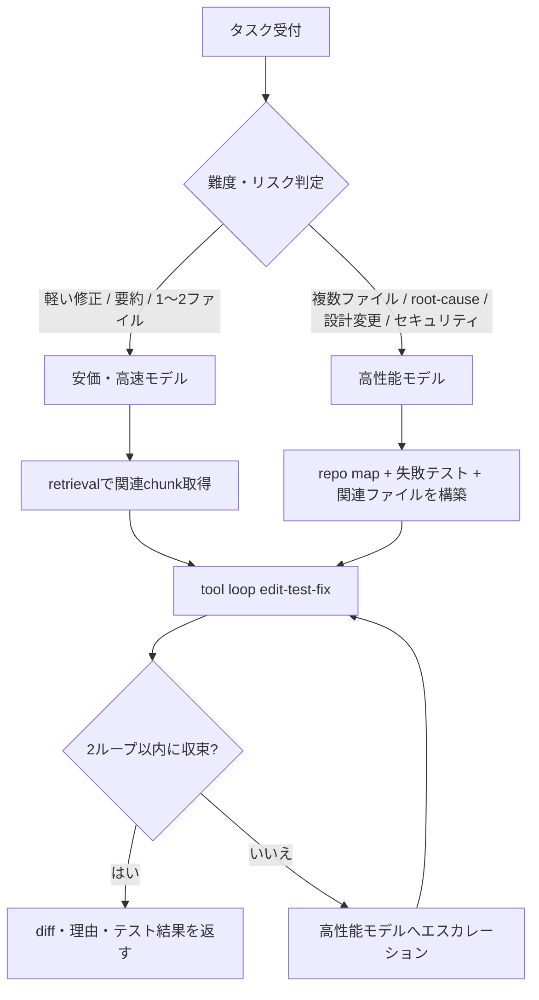
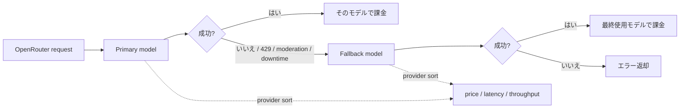

# OpenRouter対応ロングコンテキストモデル選定レポート

## エグゼクティブサマリー

2026年4月28日時点で、**OpenRouter対応・長コンテキスト・agentic coding向け**という条件を同時に満たし、しかも**純粋な価格性能比**を重視するなら、最有力は **DeepSeek V4 Pro / DeepSeek V4 Flash** です。どちらも 1M トークン級コンテキストを持ち、OpenRouter 上の単価はそれぞれ **$0.435 / $0.87**、**$0.14 / $0.28** per 1M input/output tokens と非常に安く、公式技術報告では SWE Verified が **80.6 / 79.0** と報告されています。価格対性能だけを見ると、この2本が現在の“最強の安さ”です。

ただし、**本番デフォルト**としては、私は **難しいタスクを Claude Sonnet 4.6、簡単〜中程度の大量タスクを Gemini 3 Flash Preview** に分ける **split strategy** を推奨します。理由は単純で、Sonnet 4.6 は 1M コンテキスト・SWE Verified 79.6%・Anthropic の詳細な prompting / caching / pricing ドキュメントが揃っており、**信頼性・安全性・運用知見が厚い**からです。一方 Gemini 3 Flash Preview は 1M コンテキスト・SWE Verified 78%・**Gemini 2.5 Pro 比 3倍の処理速度**を Google 自身が案内しており、単価も **$0.50 / $3.00** per 1M とかなり安いので、日常の edit–run–fix ループを高速に回しやすいです。

もし**単一モデルだけ**で運用するなら、最も現実的なのは **Gemini 3 Flash Preview** です。理由は、長コンテキスト、コーディング性能、低レイテンシ、コストの4点が最もバランスしているからです。逆に、**安全側に倒した単一モデル**が欲しいなら **Claude Sonnet 4.6** が最良です。なお、Gemini 3 Flash も Gemini 3.1 Pro も OpenRouter 上では “latest family alias” 系が存在する一方、latest alias は将来の更新で中身が変わり得るため、CI や再現性が必要な自動化では**日付付き slug を固定**するのが安全です。

本稿の候補は、entity["company","Anthropic","ai company"]、entity["company","Google","technology company"]、entity["company","OpenAI","ai company"]、entity["company","DeepSeek","ai company"]、entity["company","Mistral AI","ai company"] の**現行 OpenRouter 掲載モデル**を中心に絞り込みました。日本語の一次情報が存在したものについては優先して採用しており、特に Gemini 系は Google の日本語公式ブログを参照しています。

## 評価基準と前提

この選定では、「難しいタスクから簡単なタスクまでを1つの agentic coding workflow で回す」という条件に合わせて、以下の重みを採用しました。**最重要は“複雑なコード課題を解けること”**ですが、現場では簡単なタスクが大量に流れるため、**コスト**と**レイテンシ**も強く効きます。

| 評価軸 | 重み | このレポートでの見方 |
|---|---:|---|
| 複雑コーディング性能 | 30 | SWE-bench / Terminal-Bench / LiveCodeBench / 公式の coding 訴求を重視 |
| コスト per 1k tokens | 20 | 実運用では input が多く output が少ない前提で重視 |
| コンテキスト長 | 15 | 256k は実用域、1M は repo-wide / docs-wide で優位 |
| レイテンシ | 10 | 公式に低遅延・高速と明示されたモデルを高評価 |
| 信頼性 | 10 | preview / freshly released より GA / 成熟モデルを高評価 |
| 安全性・ガードレール | 5 | 公開システムカードや安全文書の厚さを加味 |
| OpenRouter提供性 | 5 | OpenRouter 上の現行 availability と routing しやすさ |
| モデルサイズ | 5 | 公開値がある場合は active params を優先。未公表は「未公表」扱い |

コスト比較では、月額試算の前提として **input:output = 75:25** の混合比を置きます。これは coding agent が**読む量のほうが書く量より多い**ことを反映した便宜的な仮定です。なお、この比率は**未指定**なので、本稿独自の仮定です。

重要な注意として、**ベンチマーク値は厳密な apples-to-apples 比較ではありません**。OpenAI 自身が SWE-bench は **prompt と tools に大きく依存**すると明記しており、Anthropic は複数 trial 平均や prompt modification を併記し、DeepSeek は bash + file-edit tool を備えた**自社評価ハーネス**で 512k 上限の agent setup を使っています。したがって、ここでの数値は**方向性を見るための比較**であり、1〜2ポイント差で勝敗を断定すべきではありません。

また、**絶対レイテンシの ms 値**を同条件で公開している一次資料は多くありません。OpenAI は GPT-4.1 の長大入力時 TTFT を公表していますが、他社は「高速」「低遅延」「高スループット」などの相対表現が中心です。したがって本稿のレイテンシは、**公開一次情報に基づく相対評価**として「低 / 中 / 高」で整理します。

## 候補モデル比較

| 公式名 | Provider | OpenRouter互換 | 最大コンテキスト | 価格 | 代表ベンチ / 公式訴求 | レイテンシ | モデルサイズ | 既知の弱点 |
|---|---|---|---:|---|---|---|---|---|
| Claude Sonnet 4.6  | Anthropic | `anthropic/claude-sonnet-4.6` | 1,000,000 | 入力 $3 / 出力 $15 per 1M（= $0.003 / $0.015 per 1k） | SWE Verified 79.6、SWE Multilingual 75.9、Terminal-Bench 59.1 | 中 | 未公表 | 単価が高い。安い一括実行には不向き |
| Gemini 3 Flash Preview  | Google | `google/gemini-3-flash-preview` | 1,048,576 | 入力 $0.50 / 出力 $3.00 per 1M（= $0.0005 / $0.003 per 1k） | SWE Verified 78、Gemini 2.5 Pro 比 3倍の処理速度、near-Pro reasoning/tool use | 低 | 未公表 | Preview。将来の挙動変化リスクあり |
| DeepSeek V4 Pro  | DeepSeek | `deepseek/deepseek-v4-pro` | 1,048,576 | 入力 $0.435 / 出力 $0.87 per 1M（= $0.000435 / $0.00087 per 1k） | SWE Verified 80.6、Terminal-Bench 67.9、LiveCodeBench 93.5 | 中 | 1.6T total / 49B active | かなり新しい。公開ガードレール資料は相対的に薄い |
| DeepSeek V4 Flash  | DeepSeek | `deepseek/deepseek-v4-flash` | 1,048,576 | 入力 $0.14 / 出力 $0.28 per 1M（= $0.00014 / $0.00028 per 1k） | SWE Verified 79.0、Terminal-Bench 56.9、LiveCodeBench 91.6 | 低 | 284B total / 13B active | 難しい長期タスクでは Pro より不利 |
| GPT-4.1  | OpenAI | `openai/gpt-4.1` | 1,047,576 | 入力 $2 / 出力 $8 per 1M（= $0.002 / $0.008 per 1k） | SWE Verified 54.6、Aider whole 51.6、IFEval 87.4 | 中〜高 | 未公表 | 現行トップ層と比べ coding 指標が低め。長大入力では TTFT が伸びやすい |
| GPT-4.1 Mini  | OpenAI | `openai/gpt-4.1-mini` | 1,047,576 | 入力 $0.40 / 出力 $1.60 per 1M（= $0.0004 / $0.0016 per 1k） | SWE Verified 23.6、Aider whole 34.7、IFEval 84.1 | 低 | 未公表 | hardest bug-fix / multi-file refactor には弱い |
| Devstral 2 2512  | Mistral AI | `mistralai/devstral-2512` | 262,144 | 入力 $0.40 / 出力 $2.00 per 1M（= $0.0004 / $0.002 per 1k） | SWE Verified 72.2、agentic coding 特化、open-weight | 中 | 123B dense | 1M級でない。汎用対話は frontier generalist に劣る場面あり |
| Gemini 3.1 Pro Preview  | Google | `google/gemini-3.1-pro-preview` | 1,048,576 | 入力 $2 / 出力 $12 per 1M（= $0.002 / $0.012 per 1k） | ARC-AGI-2 77.1、Google は “best model for vibe coding and agentic coding” と案内 | 中 | 未公表 | Preview。今回確認した一次資料では coding benchmark の横並び比較が限定的 |

**読み解き方**はかなりはっきりしています。**価格性能比**なら DeepSeek V4 Pro / Flash が突出しています。**安いのに弱くない**どころか、公開技術報告ベースでは hard coding 系でもかなり高い位置です。対して **Claude Sonnet 4.6** は最安ではありませんが、**成熟度・運用知見・高難度タスクの安定感**が強みです。**Gemini 3 Flash Preview** は、この2つの中間に位置する「実運用で最も使いやすい値段と速さのモデル」です。

## 推奨構成

### 本番デフォルトの推奨

**推奨 split strategy** は次の通りです。

- **難しいタスク**: `anthropic/claude-sonnet-4.6`
- **簡単〜中程度の大量タスク**: `google/gemini-3-flash-preview`

この組み合わせを推す理由は、**hard task と easy task で要求が違う**からです。repo-wide な設計変更、複数ファイル横断の root-cause 分析、複雑な test-fix loop、曖昧仕様の安全側判断では、単価差よりも**安定して最後まで解き切る能力**が重要です。その点で Sonnet 4.6 は 1M context を標準価格で使え、SWE Verified 79.6 を持ち、Anthropic の prompting / adaptive thinking / prompt caching / batch の実運用ドキュメントが厚いので、agent 開発時の“ハマりどころ”が少ないです。

一方、実際の開発現場では、日々のトークンの大半は「小さな修正提案」「ログ要約」「テスト失敗の要点整理」「ファイル読み解き」「1〜2ファイルの refactor」などに消えます。ここを全部 Sonnet に投げると**品質は高いがコスト効率は悪い**です。Gemini 3 Flash Preview は 1M context、SWE Verified 78、低遅延、そして単価が Sonnet よりかなり安いので、**最初の一手**や**高速な試行**に非常に合っています。

### コスト最優先の代替案

もし優先順位が**安全性や成熟度よりも、とにかく価格性能比**であるなら、次の split のほうが強いです。

- **難しいタスク**: `deepseek/deepseek-v4-pro`
- **簡単タスク**: `deepseek/deepseek-v4-flash`

この構成は、OpenRouter 上の単価だけを見ると**驚くほど安い**うえに、DeepSeek の公式報告では coding / agentic 指標が高いので、**純粋なコスト効率**では今回の最上位候補です。特に V4 Flash は単価が非常に低いのに SWE Verified 79.0 とされており、simple / medium workload の“投げ先”としては破格です。

ただし、これは**攻めた構成**です。モデルが非常に新しく、今回レビューした一次資料では capability の公開情報は厚い一方、**安全・運用・guardrails の公開文書**は Anthropic や Google より相対的に薄いです。したがって、社内コード・本番インフラ・規制対象データ・セキュリティ修正を扱うなら、最初からこの構成だけに寄せるのは慎重であるべきです。

### 単一モデルで済ませるなら

単一モデルしか置けないなら、**総合的な value winner は Gemini 3 Flash Preview** です。コーディング性能、長コンテキスト、低遅延、低価格のバランスがもっとも良いからです。逆に、**単一モデルでも hard task 失敗率を下げたい**なら Claude Sonnet 4.6 を選ぶべきです。GPT-4.1 / GPT-4.1 Mini は OpenAI の ecosystem と state management が非常に強い一方、今回の official coding 指標では上位候補に一歩届きません。Devstral 2 は open-weight やローカル展開志向なら魅力がありますが、1M 級 context が必要な wide repo workflows では不利です。

## エージェント型コーディングの運用指針

### プロンプト設計

agentic coding では、単なる「コードを書いて」では足りません。OpenAI の GPT-4.1 ガイドは、少なくとも **Persistence / Tool-calling / Planning** の3点を system prompt に含めることを推奨しており、これだけで internal SWE-bench Verified を大きく改善したと述べています。つまり、モデルには「解決するまで止まるな」「分からないことは tool で確認しろ」「各 tool call の前後で計画と反省をしろ」を明示するべきです。

Anthropic 側では、複雑 prompt を **XML タグ**で分解し、`<instructions>`, `<context>`, `<files>`, `<tests>`, `<constraints>` のように構造化することを推奨しています。さらに長文入力では、**長い資料は上に、具体的な質問は下に**置くとよく、引用ベースで grounding させるとノイズに強くなるとしています。GPT-4.1 では、逆に critical instruction を**先頭と末尾の両方**に置くのが良いとされるので、実務上は「高レベル制約 → ドキュメント / ファイル群 → 最終タスク再掲」という sandwich 構成が安定です。

### 長コンテキストとチャンク化

1M context があっても、**毎回まるごと repo を投げる運用は勧めません**。Google は 1M tokens で約 50,000 行のコードを処理できると案内していますが、同時に長コンテキストの最適活用を考えるべきだとも述べています。実務では、まず **repo map / 依存関係 / failing tests / relevant files / recent diffs** を抽出し、それを working set として詰めるのが基本です。全 repo 詰め込みは、横断 refactor、設計監査、あるいは retrieval だけでは取りこぼしやすい case に限定すべきです。

OpenAI も context window は input / output / reasoning tokens をすべて含むと明記しており、長いやり取りでは compaction を使って state を圧縮するよう案内しています。つまり、**大きい context window は“無限メモリ”ではなく、より賢く使うための余裕**と捉えるのが正解です。

### Retrieval と embedding の組み込み

repo や設計文書のような**安定した知識ベース**には、長コンテキストよりまず RAG を入れるべきです。OpenAI Retrieval は semantic similarity を用いた vector store 検索を提供し、ファイルは自動で chunking / embedding / indexing されます。Google Gemini API の File Search も、ファイルを import・chunk・index して RAG を構成し、クエリ時の relevant information を context として渡せます。

特に Gemini File Search は、**query 時の file storage と embedding generation を free** とし、**最初の index 作成時の embedding 作成費**と通常の model tokens だけを払う形を打ち出しています。したがって、“毎回巨大 prompt を投げる”よりも、“最初に index して必要 chunk だけ retrieval する”構成のほうが、継続運用では明確に安くなりやすいです。embedding 側は OpenAI の `text-embedding-3-small / large` か、Google の Gemini Embedding / Gemini Embedding 2 をまず候補にすればよいです。citeturn37view1turn36view4turn26search16turn23search19

### メモリ管理

実運用では、メモリを **作業メモリ / 圧縮サマリ / 永続ベクトルメモリ** の三層に分けるのが安定です。作業メモリには現在の failing tests、編集対象ファイル、plan、直近 tool results を入れます。会話が伸びたら OpenAI の compaction のように要点を圧縮し、issue の背景や仕様、設計判断、用語集、過去の PR などは vector store 側に逃がします。Responses API の `previous_response_id` のような state chaining が使える環境では、それも有効です。

また、reasoning 系モデルを multi-turn tool calling と組み合わせる場合は、OpenRouter が説明している通り、**reasoning details を保持して次の tool result に渡す**設計が重要です。これを捨てると、途中までの推論の連続性が失われ、長い tool loop の質が落ちます。

### 温度設定とデコード

ここは公式値が揃いにくい領域なので、以下は**実運用ヒューリスティック**です。**patch 生成・test fix・tool-heavy loop** は **temperature 0〜0.2** を基本にし、architecture の代替案出しや UI/UX の発散では **0.3〜0.5** に上げます。`top_p` はデフォルト据え置きで十分なことが多く、まずは prompt の明確化と tool contract の改善を優先すべきです。OpenAI も Anthropic も、agentic behavior は sampling より **prompt clarity / tool definitions / explicit workflow** に強く依存すると示しています。

### コスト制御

コスト制御で効くのは、実はモデル選定だけではありません。OpenRouter はデフォルトで**価格優先の provider load balancing**を行い、必要なら `sort: "latency"` や `sort: "throughput"` に切り替えられます。さらに `models` 配列で fallback chain を定義でき、最終的に使われたモデルだけが課金対象になります。routing / fallback を有効にしても、成功しなかった経路について一定の無駄課金が増えるわけではない、という点は実運用で大きいです。

加えて、OpenRouter と各ベンダーの caching を必ず使うべきです。Anthropic は prompt caching が**コストとレイテンシを下げる**と明記し、5分 cache write 1.25x、read 0.1x で、**1回の cache hit でも元を取りやすい**構造です。OpenAI も stable content を**先頭に寄せて** cache hit を最大化するよう案内しています。OpenRouter の Gemini implicit caching も、安定 prefix を固定し、変動部分を末尾に寄せることを推奨しています。まったく同じ request が繰り返されるなら、OpenRouter の **response caching beta** も候補です。citeturn20view4turn22search17turn37view5turn26search23

CI や本番自動化では、**latest alias ではなく日付付き slug を固定**してください。OpenRouter の family alias は便利ですが、中身が将来更新されるので、回帰調査やベンチ再現が難しくなります。逆に、手元の CLI や exploratory use では family alias のほうが扱いやすいです。

このワークフローは、prompt engineering・long context・retrieval・tool calling を組み合わせた実務向けの最小構成です。cheap model を first-pass に使い、**失敗回数・編集ファイル数・ツールエラー回数**で hard model に昇格させると、費用対効果が非常に良くなります。

## コスト試算

月額試算の前提は次の通りです。**未指定**だったため、本稿では **small = 100k、medium = 1M、large = 10M tokens / month** とし、**75% input / 25% output**、**1リクエスト平均 2,000 tokens** と仮定します。したがって、ざっくり **50 / 500 / 5,000 requests per month** に相当します。これには **RAG ストレージ、外部検索、code execution、ベクトル DB、managed-agent の時間課金** は含めません。なお、実際の coding session はこれよりかなり大きくなることがあり、Anthropic の worked example では **1時間の coding session で 65k tokens** を使っています。

### モデル別の概算月額

| モデル | 100k tokens/月 | 1M tokens/月 | 10M tokens/月 |
|---|---:|---:|---:|
| Claude Sonnet 4.6 | $0.60 | $6.00 | $60.00 |
| Gemini 3 Flash Preview | $0.1125 | $1.125 | $11.25 |
| DeepSeek V4 Pro | $0.0544 | $0.5438 | $5.4375 |
| DeepSeek V4 Flash | $0.0175 | $0.175 | $1.75 |
| GPT-4.1 Mini | $0.07 | $0.70 | $7.00 |
| Devstral 2 | $0.08 | $0.80 | $8.00 |
| GPT-4.1 | $0.35 | $3.50 | $35.00 |
| Gemini 3.1 Pro Preview | $0.45 | $4.50 | $45.00 |

この表だけを見ると、**DeepSeek V4 Flash の安さが極端**です。次点の Gemini 3 Flash Preview や GPT-4.1 Mini と比べても、simple-task 向け throughput 用途ではかなり有利です。一方、hard-task 用の単一モデルとして Sonnet 4.6 を全面採用しても、今回の token 前提では月額はまだ小さいですが、**実際の repo-scale agent loop では 1セッションあたりの token 消費が急増**しやすい点に注意が必要です。

### 戦略別の概算月額

以下は、**hard 20% / simple 80%** で routing した場合の blended estimate です。

| 戦略 | 100k tokens/月 | 1M tokens/月 | 10M tokens/月 |
|---|---:|---:|---:|
| 推奨 split: Sonnet 4.6 20% + Gemini 3 Flash 80% | $0.21 | $2.10 | $21.00 |
| 低コスト split: DeepSeek V4 Pro 20% + V4 Flash 80% | $0.0249 | $0.2488 | $2.4875 |
| 保守 split: Sonnet 4.6 20% + GPT-4.1 Mini 80% | $0.176 | $1.76 | $17.60 |
| 単一モデル: Gemini 3 Flash Preview 100% | $0.1125 | $1.125 | $11.25 |
| 単一モデル: Claude Sonnet 4.6 100% | $0.60 | $6.00 | $60.00 |

この表から分かるのは、**split strategy の費用対効果が非常に大きい**ことです。特に Sonnet + Gemini Flash の組み合わせは、**hard task の品質を確保しながらコストを Sonnet 単独の約3分の1**に抑えられます。さらに、OpenRouter では provider fallback を有効にしても**最終的に使われたモデルで課金**されるので、可用性を上げつつ料金を管理しやすいです。

この routing は OpenRouter の **provider selection** と **model fallbacks** の仕組みに沿っています。デフォルトは価格優先ですが、latency 重視なら provider sort を切り替え、さらに `models` 配列で hard fallback を定義するのが実務的です。

## 導入判断の結論

結論を一文で言うと、**production default は “Claude Sonnet 4.6 for hard + Gemini 3 Flash Preview for easy”**、**absolute cost priority なら “DeepSeek V4 Pro + DeepSeek V4 Flash”** です。前者は品質・成熟度・公開運用知見を重視した構成、後者は価格性能比を極限まで取りにいく構成です。

導入時の実装は、まず cheap model を default router に置き、**2回以上の failed tool loop、複数ファイル横断、未解決テスト、build system / infra / security 変更、入力 context が重い案件**だけ hard model に上げる形がよいです。そして CI / production bots は version-pinned slug、手動 CLI や notebook では latest alias を使い分けてください。OpenRouter の routing、caching、fallback を素直に使うだけで、**単一モデル運用よりかなり安く、しかも落ちにくい設計**にできます。

したがって、あなたの要件が「**難しいものから簡単なものまで広くこなす agentic coding workflow**」であるなら、私の最終推奨は次の通りです。**第一推奨は split: `anthropic/claude-sonnet-4.6` + `google/gemini-3-flash-preview`。第二推奨は low-cost split: `deepseek/deepseek-v4-pro` + `deepseek/deepseek-v4-flash`。単一モデルなら `google/gemini-3-flash-preview`。** これが、現時点での品質・速度・長コンテキスト・コストの最も現実的な落としどころです。