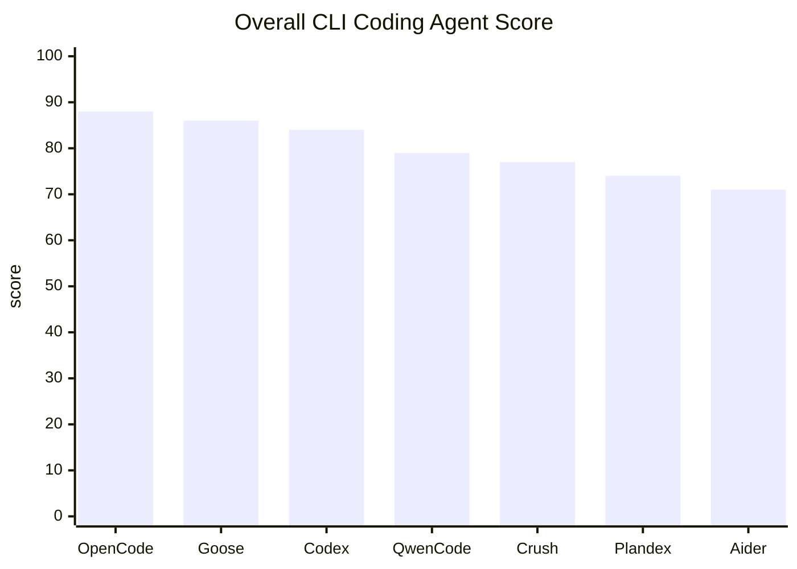

# CLI-focused Recommended Coding Agents

This page collects coding agents selected specifically for terminal-first (CLI) use and focuses on agents that are practical to configure, run, and extend entirely from the command line.

Quick summary

- Best overall CLI flexibility: OpenCode
- Best for official/commercial ecosystems on CLI: Codex CLI
- Best lightweight daily editing tool: Aider
- Best terminal UX/TUI experience: Crush
- Best for MCP/Extensions-driven workflows: Goose / Qwen Code

## Top recommendations (CLI perspective)

1. OpenCode — Broad multi-provider support and rich extension surface. Easy to integrate local models and custom providers; strong CLI primitives for sessions and webfetch.
2. Goose — Strong MCP/extension ecosystem, skills marketplace, session persistence, and automation-oriented workflow design.
3. Codex CLI — OpenAI's official CLI with plugin/marketplace momentum and Ollama/local integrations suitable for commercial deployments.
4. Qwen Code — Fast-moving multi-provider agent with MCP, extensions, skills, WebSearch/WebFetch, and checkpointing.
5. Crush — Polished TUI and multi-model/LSP support for users who spend most of their time in a terminal.
6. Plandex — Strong long-running planning, branching, and context-management workflow for larger implementation plans.
7. Aider — Lightweight, low-friction CLI-first assistant for everyday edits and pair-programming in the terminal.

## Evaluation method

The comparison scope is intentionally narrow: publicly available coding agents that can be used from the CLI and can switch models or providers at the API/configuration level.

Scores prioritize agent-platform capabilities, not only editing quality. Tools with MCP, plugins, skills, marketplace/distribution, session management, auto-compaction, web search/fetch, and flexible provider support score higher than editor-only tools.

Feature cells use `C/M/S = Completeness / Maturity / Stability`, each on a 0-5 scale.

- Completeness: how fully the feature exists as a user-facing product capability.
- Maturity: documentation quality, release history, and implementation age.
- Stability: recent issue pattern, known rough edges, and operational predictability.

## Overall score

| Rank | Tool | Score | Subscription bonus | Best fit |
|---:|---|---:|---:|---|
| 1 | OpenCode | 88 | +5 | Best overall CLI agent platform with broad provider, MCP, skills, plugin, web, and session coverage |
| 2 | Goose | 86 | +5 | Best for MCP/extension-driven automation workflows |
| 3 | Codex CLI | 84 | +5 | Best official/commercial ecosystem choice for OpenAI-oriented teams |
| 4 | Qwen Code | 79 | +4 | Fast-moving multi-provider agent with strong extension potential |
| 5 | Crush | 77 | +5 | Best terminal UX/TUI choice with multi-model and LSP support |
| 6 | Plandex | 74 | +0 | Strongest long-running planning and context-management workflow |
| 7 | Aider | 71 | +3 | Most practical lightweight terminal editor assistant |

## Feature comparison

| Tool | MCP | Plugin | Skills | Marketplace | Resume | Sessions |
|---|---|---|---|---|---|---|
| OpenCode | 5/4/4 | 5/4/4 | 5/4/4 | 1/1/3 | 5/4/3 | 5/4/3 |
| Goose | 5/4/4 | 5/4/4 | 5/4/4 | 5/4/4 | 5/4/4 | 5/4/4 |
| Codex CLI | 5/4/4 | 5/4/3 | 5/4/3 | 5/4/3 | 5/4/3 | 5/4/3 |
| Qwen Code | 5/3/3 | 5/3/3 | 5/3/4 | 4/3/3 | 4/3/3 | 2/2/3 |
| Crush | 5/4/3 | 0/0/0 | 4/4/4 | 0/0/0 | 4/4/3 | 4/4/3 |
| Plandex | 0/0/0 | 0/0/0 | 0/0/0 | 0/0/0 | 4/5/4 | 5/5/4 |
| Aider | 0/0/0 | 0/0/0 | 0/0/0 | 0/0/0 | 4/5/4 | 2/4/4 |

| Tool | Auto-compaction | Tools | WebSearch | WebFetch | Read | Edit | Subscription usable |
|---|---|---|---|---|---|---|---|
| OpenCode | 5/4/4 | 5/4/4 | 5/4/4 | 5/4/4 | 5/4/4 | 5/4/4 | Yes |
| Goose | 5/4/4 | 5/4/4 | 4/4/3 | 4/4/4 | 5/4/4 | 5/4/4 | Yes |
| Codex CLI | 5/4/3 | 5/4/3 | 4/4/3 | 3/3/3 | 5/4/3 | 5/4/3 | Yes |
| Qwen Code | 2/2/3 | 5/3/3 | 5/3/3 | 4/3/3 | 5/3/3 | 5/3/3 | Yes |
| Crush | 4/3/3 | 4/4/3 | 1/1/2 | 0/0/0 | 4/4/4 | 4/4/4 | Yes |
| Plandex | 5/5/4 | 3/4/4 | 0/0/0 | 3/4/4 | 5/5/4 | 4/5/4 | Unconfirmed |
| Aider | 5/5/4 | 4/5/4 | 0/0/0 | 4/5/4 | 5/5/4 | 5/5/4 | Yes |

## Per-tool CLI notes

OpenCode

- CLI-first extensibility: supports 75+ providers, plugins/skills, native websearch/webfetch.
- Full session features (continue/fork/share) and auto-compaction policies.
- Best when you want one terminal-first agent platform that can cover provider switching, MCP, skills, web tools, and long-running sessions.
- Caveat: marketplace-style distribution is less mature than Goose or Codex CLI, and compaction/model discovery/TUI issues still need operational monitoring.

Goose

- Strong MCP-centered architecture with extension directory, skills marketplace, session persistence, memory-oriented features, and auto-compaction.
- Best when you want to build repeatable automation workflows rather than only edit code interactively.
- Caveat: some provider bridge modes may not expose the full Goose extension ecosystem, and the project is still changing quickly.

Codex CLI

- Official OpenAI CLI. `config.toml` and Ollama integration enable custom provider/local model workflows.
- Growing plugin/marketplace ecosystem and favorable for commercial/enterprise use.
- Best when your team already uses ChatGPT/Codex subscriptions or needs an official commercial ecosystem.
- Caveat: custom provider and local-model switching still have rough edges, especially around history visibility, model switchers, and compact behavior.

Qwen Code

- Fast-growing multi-provider CLI with `modelProviders`, MCP, extensions, skills, WebSearch/WebFetch, checkpointing, and read/edit tools.
- Best when you want a broad modern agent surface and can tolerate a younger implementation.
- Caveat: recent issues around auth, provider display, and MCP/provider connections mean environment-level validation is important.

Aider

- Practical CLI modes (`/ask`, `/architect`, `/web`, `--read`) and strong Git/diff editing flow compatibility.
- Low adoption cost and predictable behavior for everyday edits.
- Best when you mainly want fast, predictable terminal-based edits rather than a full agent platform.
- Caveat: limited MCP/plugins/skills/marketplace extensibility compared to OpenCode, Goose, Codex CLI, or Qwen Code.

Crush

- Polished TUI from Charmbracelet, with multi-model and LSP support for terminal-first power users.
- Agent skills, LSP integration, and session-based context make it a strong terminal UX option.
- Caveat: plugin, marketplace, and native websearch/webfetch capabilities are limited compared to the platform-style agents.

Plandex

- Strong long-running planning model with plans, branches, model packs, role-based models, and context-window management.
- Best when the work is a long multi-step implementation plan rather than ad-hoc pair editing.
- Caveat: weak MCP/plugin/skills/marketplace/native websearch coverage under this evaluation model.

## How to choose (CLI-focused)

- Maximize freedom and extensibility: OpenCode
- Leverage existing OpenAI subscriptions and enterprise readiness: Codex CLI
- Minimal friction daily CLI edits: Aider
- Terminal UX/TUI priority: Crush
- Build extension-driven workflows (MCP/Skills): Goose / Qwen Code

## Validation checklist (before adoption)

1. Test Web Tools / compaction / session behavior when swapping providers
2. Validate real-world switching for local models (Ollama etc.) and profile management
3. Confirm plugin/skill installation steps and permission model via CLI
4. Verify session persistence, resume/fork behavior and storage requirements
