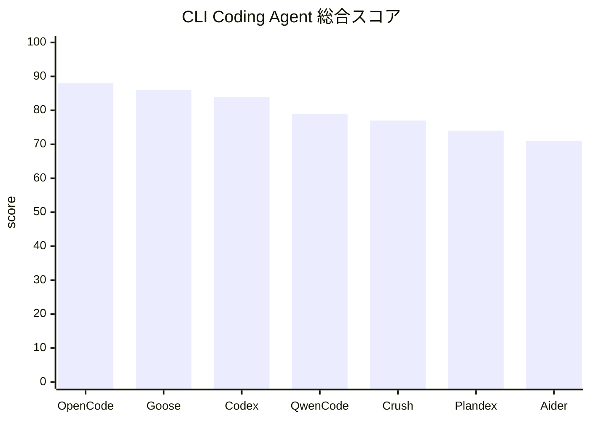

# CLIにフォーカスしたおすすめコーディングエージェント

このページは「CLI（端末）での利用を第一に考える」観点で、実務に適したコーディングエージェントをまとめたものです。

要約（短く）

- 最も柔軟でCLI中心の選択肢: OpenCode
- 公式・商用エコシステムを重視したいCLIユーザー: Codex CLI
- 軽量で日常編集向け: Aider
- ターミナルUX/TUI重視: Crush
- 拡張ワークフロー（MCP/Extensions）重視: Goose / Qwen Code

## 推奨トップ（CLI観点）

1. OpenCode — 多プロバイダ対応と豊富な拡張が魅力。ローカルモデルやカスタム provider を組み込みやすく、セッション管理や webfetch 等の CLI 機能が充実しています。
2. Goose — MCP / extension ecosystem、skills marketplace、session persistence、自動化ワークフローの設計が強みです。
3. Codex CLI — OpenAI 系の公式 CLI。plugin / marketplace エコシステムと Ollama 等のローカル統合が強みで、商用環境に向きます。
4. Qwen Code — MCP、Extensions、Skills、WebSearch/WebFetch、checkpointing を備えた成長の速い multi-provider agent です。
5. Crush — Charmbracelet 流の優れた TUI を持ち、端末での操作感を重視するユーザーに合います。
6. Plandex — 長時間の計画実行、branch、context 管理を重視する大きめの実装計画に向きます。
7. Aider — 学習コストが小さく安定して使える軽量 CLI ツール。日常の編集やペアプロ向けに最短距離で使えます。

## 評価方法

比較対象は「公開配布されている」「CLI から使える」「API または設定レベルでモデルや provider を差し替えられる」Coding Agent に絞っています。

採点では、単純なコード編集品質だけでなく、エージェント基盤としての広さを重視しました。具体的には MCP、plugin、skills、marketplace/distribution、session 管理、auto-compaction、WebSearch/WebFetch、provider 切替の柔軟性が強いツールほど高得点になります。

機能比較のセルは `C/M/S = 完成度 / 成熟度 / 安定度` で、各 0〜5 点です。

- 完成度: その機能が製品機能としてどこまで揃っているか。
- 成熟度: ドキュメント、release 運用、実装年齢、継続更新の強さ。
- 安定度: recent issue、既知バグ、実運用時の予測可能性。

## 総合スコア

| 順位 | ツール | スコア | サブスク加点 | 向いている用途 |
|---:|---|---:|---:|---|
| 1 | OpenCode | 88 | +5 | provider、MCP、skills、plugin、Web、session を広く備えた総合型 CLI agent |
| 2 | Goose | 86 | +5 | MCP / extension を中心に自動化ワークフローを組みたい場合 |
| 3 | Codex CLI | 84 | +5 | OpenAI 系の公式・商用エコシステムを重視するチーム |
| 4 | Qwen Code | 79 | +4 | 拡張性が高く成長の速い multi-provider agent を試したい場合 |
| 5 | Crush | 77 | +5 | terminal UX / TUI と multi-model / LSP を重視する場合 |
| 6 | Plandex | 74 | +0 | 長時間の計画実行と context 管理を重視する場合 |
| 7 | Aider | 71 | +3 | 軽量で実用的な端末ベースの編集支援が欲しい場合 |

## 機能比較

| ツール | MCP | Plugin | Skills | Marketplace | Resume | Sessions |
|---|---|---|---|---|---|---|
| OpenCode | 5/4/4 | 5/4/4 | 5/4/4 | 1/1/3 | 5/4/3 | 5/4/3 |
| Goose | 5/4/4 | 5/4/4 | 5/4/4 | 5/4/4 | 5/4/4 | 5/4/4 |
| Codex CLI | 5/4/4 | 5/4/3 | 5/4/3 | 5/4/3 | 5/4/3 | 5/4/3 |
| Qwen Code | 5/3/3 | 5/3/3 | 5/3/4 | 4/3/3 | 4/3/3 | 2/2/3 |
| Crush | 5/4/3 | 0/0/0 | 4/4/4 | 0/0/0 | 4/4/3 | 4/4/3 |
| Plandex | 0/0/0 | 0/0/0 | 0/0/0 | 0/0/0 | 4/5/4 | 5/5/4 |
| Aider | 0/0/0 | 0/0/0 | 0/0/0 | 0/0/0 | 4/5/4 | 2/4/4 |

| ツール | Auto Compaction | Tools | WebSearch | WebFetch | Read | Edit | サブスク利用 |
|---|---|---|---|---|---|---|---|
| OpenCode | 5/4/4 | 5/4/4 | 5/4/4 | 5/4/4 | 5/4/4 | 5/4/4 | あり |
| Goose | 5/4/4 | 5/4/4 | 4/4/3 | 4/4/4 | 5/4/4 | 5/4/4 | あり |
| Codex CLI | 5/4/3 | 5/4/3 | 4/4/3 | 3/3/3 | 5/4/3 | 5/4/3 | あり |
| Qwen Code | 2/2/3 | 5/3/3 | 5/3/3 | 4/3/3 | 5/3/3 | 5/3/3 | あり |
| Crush | 4/3/3 | 4/4/3 | 1/1/2 | 0/0/0 | 4/4/4 | 4/4/4 | あり |
| Plandex | 5/5/4 | 3/4/4 | 0/0/0 | 3/4/4 | 5/5/4 | 4/5/4 | 未確認 |
| Aider | 5/5/4 | 4/5/4 | 0/0/0 | 4/5/4 | 5/5/4 | 5/5/4 | あり |

## 各ツールのCLI観点ポイント

OpenCode

- CLI-first な拡張性: 75+ provider、plugins/skills、websearch/webfetch をネイティブでサポート。
- セッションの継続・フォーク・共有、auto-compaction などエージェント基盤が充実。
- provider 切替、MCP、skills、Web Tools、長いセッションを1本で広く扱いたい場合に最も向く。
- 注意: Goose や Codex CLI と比べると marketplace 的な配布面はまだ薄く、compaction / model discovery / TUI 周辺は運用監視が必要。

Goose

- MCP を中核にした設計が強く、extension directory、skills marketplace、session persistence、memory 系機能、auto-compaction が揃う。
- 単なる対話編集ではなく、再利用できる自動化ワークフローを CLI で組みたい場合に向く。
- 注意: CLI provider bridge の使い方によっては Goose 側の extension ecosystem をフルに使えない場合があり、プロジェクト自体の変化も速い。

Codex CLI

- OpenAI 公式の CLI。`config.toml` や Ollama 統合でカスタム provider / ローカルモデルの運用が可能。
- plugin / marketplace の成長が速く、商用や組織利用での互換性が取りやすい。
- ChatGPT / Codex 系サブスクリプションを既に使っているチームや、公式・商用エコシステムを重視する場合に向く。
- 注意: custom provider / local model 切替は使える一方、model switcher、履歴表示、compact 周辺にはまだ粗さが残る。

Qwen Code

- `modelProviders` による multi-provider 切替、MCP、Extensions、Skills、WebSearch/WebFetch、checkpointing、read/edit tool が急速に揃っている。
- 現代的な agent 機能を広く試したいが、上位勢より若い実装でも許容できる場合に向く。
- 注意: auth、provider 表示、MCP / provider connection 周辺の recent issues があるため、導入前の環境検証が重要。

Aider

- `/ask`、`/architect`、`/web`、`--read` 等、端末操作で使いやすいモードが揃う。
- Git/diff ベースの編集に馴染むため、既存の開発フローに入りやすい。
- agent platform というより、素早く安定した端末ベース編集支援が欲しい場合に強い。
- 注意: MCP・plugin・skills・marketplace は OpenCode / Goose / Codex CLI / Qwen Code と比べて弱い。

Crush

- 優れた TUI と multi-model/LSP 対応が特徴。端末上で快適な操作感を提供。
- agent skills、LSP 統合、session-based context により、terminal UX 重視の選択肢として強い。
- 注意: plugin、marketplace、native websearch/webfetch は platform 型 agent と比べて限定的。

Plandex

- plans、branches、model packs、role-based models、context-window management など、長時間の計画実行に強い。
- ad-hoc なペア編集より、複数ステップの長い実装計画を管理したい場合に向く。
- 注意: MCP・plugin・skills・marketplace・native websearch は今回の評価軸では弱い。

## 選び方（CLI向け）

- 自由度・拡張性を最大化したい: OpenCode
- 既存のOpenAI系サブスクや商用運用を活かしたい: Codex CLI
- 学習コストを抑え、安定して日常運用したい: Aider
- ターミナル体験（UX）を最優先する: Crush
- MCP/Extensions を中心にワークフローを組みたい: Goose / Qwen Code

## 評価・検証チェックリスト（導入前）

1. provider を差し替えたときの Web Tools / compaction / session の振る舞いを検証
2. local model（Ollama 等）を実運用で切り替えられるか確認
3. plugin/skill の導入手順と権限モデルを確認
4. セッション保存・resume/ fork の動作とストレージ要件を確認
